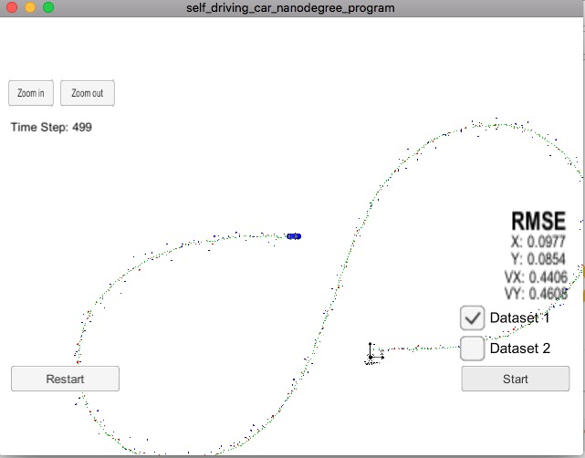
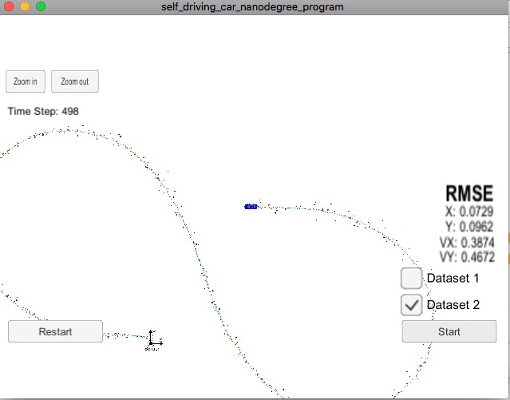

## **Extended Kalman Filter (EKF)**

### Overview

---
In this project an [extended Kalman filter](https://en.wikipedia.org/wiki/Extended_Kalman_filter) is implemented (in C++) to estimate the state of a moving object of interest with noisy Lidar and Radar measurements. The object runs in a simulator which can be downloaded [here](https://github.com/udacity/self-driving-car-sim/releases). Also, [uWebSocketIO](https://github.com/uWebSockets/uWebSockets) is needed in this project which is responsible for the communication between the extended Kalman filter and the simulator.

### Dependencies
---
* cmake >= 3.5
* make >= 4.1 (Linux, Mac)
* gcc/g++ >= 5.4
 

### Building the code 
---
Once the install for uWebSocketIO is complete, the main program can be built and run by doing the following from the project top directory.

1. mkdir build
2. cd build
3. cmake ..
4. make

Note: This would generate an excutable **ExtendedKF** in the **build** directory.

### Running and testing EKF
---

1. Run the simulator
2. Execute ./ExtendedKF in the build directory 
3. Choose Dataset 1 or 2 in the simulator and Click **Start** button

The following figures show the positions from the measurements (red and blue dots) and the esitimate positions from the EKF (green dots) at each time step.  Also, the real-time RMSEs (in terms of position and velocity) can be observed when the object is moving. The RMSEs at the final time step are shown in the figures below. 

